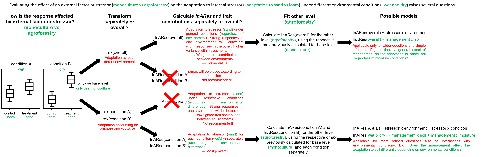

<!-- badges: start -->
[](https://CRAN.R-project.org/package=InARes)
[](https://github.com/Maki-science/InARes/actions/workflows/R-CMD-check.yaml)
[](https://app.codecov.io/gh/Maki-science/InARes?branch=main)
<!-- badges: end -->

# InARes

## What is it about?
The focus of recent research shifts towards complex ‘whole organism’ responses (i.e., in multiple functional traits) in adaptation to or to defend against stressors under complex environmental conditions. This increasing complexity is challenging to analyse and demands sophisticated tools to drive meaningful conclusions from those data. Trait-based regression models, multivariate analyses, like principal component analyses, and plasticity indices can be used to tackle challenges with those complex investigations. But those methods have substantial limitations, like the need for high sample size, multi-dimensionality of results or the need for trait coordination in high-dimensional space, or the calculation on the population level, which might buffer or cover the de facto occurring individual effects. 

To improve and simplify studies on ‘whole organism’ responses, analyses, and their interpretation, we developed the Index for Adaptive Responses. This straightforward framework can unite all traits of an organism in one number. A newly developed transformation method, included in this framework, comprises a normalisation and standardisation to a baseline or control without changing the data or variance structure of the original data. We assessed the performance and accuracy of the framework with an application in an extensive predator-prey case study, with simulations and application examples using literature data.

In the corresponding publication, we show that the Index for Adaptive Responses respects adaptations as well as maladaptations and outperforms established approaches. The framework is robust against outliers and non-gaussian distribution. We further show that the qualitative prediction of the adaptiveness of included traits is highly accurate, even under challenging conditions, e.g., low replicate numbers. This package provides the functions and algorithms of the framework and provides examples and recommendations about its use in different situations. 

The Index for Adaptive Responses will simplify future research on complex adaptive responses and improves our understanding of these responses’ ecological as well as evolutionary implications . 


## Why should I use it?
This framework is developed for a broad applicability in all research areas, with all organisms and any stressor an organism might adapt to. The transformation method might be even usable in other disciplines. See our corresponding publication about sophisticated testing and description of the methodology and application examples. 

Use this framework/package because:

  - you study organisms which develop an adaptation to a stressor
  - you want to understand the whole organism response (in all/multiple traits)
  - you want to assess the change in the organism's adaptation towards an increase in the stressor intensity (e.g., concentration)
  - you like to investigate the impact of (multiple) other stressors on the organism's adaptation towards a "main"-stressor.
  - you are interested in the overall plasticity of an organism
  - you aim to standardize your treatments' response to a control across multiple treatments, experiments, or clones/species for a better comparability (e.g., to find common patterns)
  - you would like to increase comparability across experiments and studies
  - you would like to get an impression which of the organism's traits are adaptive and which are maladaptive upon increase
  - you are interested in which traits are probably the most important for an adaptive response
  - you don't have time and resources for elaborate experiments and prefer to use rather small sample sizes (e.g., 10 replicates) or an unreplicated experimental design
  - you have data that you would like to standardise and normalise to a reference (e.g., control)
  - this is probably the only package with a Trex ;)


## How to use it?
### Installation
As soon as this is published, you can download this package from CRAN (watch the status badge at the top).
However, you can install the (latest) development version of InARes from [GitHub](https://github.com/) with:

``` r
install.packages("devtools") # only required once
devtools::install_github("Maki-science/InARes")
```

### Delivered data example
If you like to try this framework, we provide data, along with this package, of a previous study that we used to test this framework intensively. This data was derived from an elaborate predation trial on 180 living indiviuals of the water flea Daphnia magna that were fed to its invertebrate predator Triops cancriformis. Some of the animals have been exposed to the predator before and developed morphological defences or trait enhancements. Since we used different clones with different reaction norms, we achieved a wide range of morpho types. Each individual was observed during the predation processes and each attack of the predator was recorded as one of the 704 observations. We recorded 10 morphological traits prior to the feeding trial and the predator size, as well as several success parameters (survival probability, evasion, etc.).


### General workflow
As usual, you first need to load the package:
``` r
library(InARes)
```

Then take your data at hand (here we use the data described above):
``` r
mydata <- data.InARes
```

#### First step: transformation
First, we need to transform the trait values to standardise and normalise them (put them to the same scale and range) to their reference (i.e., control). Therefore, we achieve a value that considers the relative expression (hence "rex") of a trait value compared to control.
In our case we use the column "induced", which indicates whether the individual was prior exposed to a predator ("y") or not ("n"):
``` r
# start with body length (BL)
mydata$BL_rex <- Trex(x = mydata$BL, # trait to be transformed
                      y = mydata$induced, # column where treatments can be found
                      ctrl = "n" # name of the control in the treatment's column
                      ) 
```

To do this with all 10 traits, you could copy paste this for each trait, or we use a loop as follows:
``` r
# all 10 morphological traits:
params <- c("BL", "SL", "BW", "BWL", "Forn", "Furca", "SBAd", "SBAv", "meansld", "meanslv")

# iterate over the parameter and transform each of them. Add new column for each transformed trait:
for(i in 1:length(params)){
  mydata[, paste(params[i], "_rex", sep = "")] <- Trex(x = mydata[,params[i]],
                                                       y = mydata$induced,
                                                       ctrl = "n"
                                                       )
}
```
The transformation method is robust to outliers and non-gaussian distribution. It will not change the data or variance structure and thus we don't have to consider this transformation later on, in our interpretation of the data (in very extensive cases of non-gaussian distribution, there might be a deviation from the original data by less than 10 % of a standard deviation).


#### Second step: calculate the Index for Adaptive Responses (InARes)
If we have no further knowledge or information, we can run the framework in its default form (see further below for examples of special cases). Therefore, we take all previously transformed values. The algorithm will evaluate the data and estimate whether a trait is adaptive or maladaptive. However, you can provide a priori knowledge to the algorithm to adjust the way the InARes is calculated (see further below).

``` r
results <- InARes(data = mydata,
                  traits = c("BL_rex", "SL_rex", "BW_rex", "BWL_rex", "Forn_rex", 
                             "Furca_rex", "SBAd_rex", "SBAv_rex", "meansld_rex", "meanslv_rex"),
                  treatCol = "induced",
                  ctrl = "n")
```

The function returns an object with two parts.
The first part contains the calculated InARes values, which we can use for further processing:
``` r
mydata$InARes <- results$index
```

The second part contains the rexmax values. They describe the maximum expression (positive or negative) of a trait and are used within the calculation as part of the weighing mechanism. However, they cannot be considered directly as an indicator of importance (even though it might coincide). But they can be reported in a publication for other researchers and studies, that might want to compare their data directly with your results:
``` r
results$rexmax
```

#### Third step (optional): estimate each trait's importance or contribution to the InARes value
With this step, we can estimate the importance or contribution to the InARes value and, therefore, the adaptiveness of each trait. This could also be used in a preliminary experiment with a simple control vs exposure design with low replicate numbers (best performance was estimated with 10 or more replicates). 
``` r
contARes(data = mydata, 
         params = c("BL_rex", "SL_rex", "BW_rex", "BWL_rex", "Forn_rex", 
                    "Furca_rex", "SBAd_rex", "SBAv_rex", "meansld_rex", "meanslv_rex"),
         InAResCol = "InARes",
         treatCol = "induced",
         ctrl = "n")
```
Again, the output contains two parts:
One is the numerical result. It contains the mean contribution of each trait to the control's and the treatment's InARes values and their standard deviation. These values are used to calculate the change in contribution from the control to the treatment (with a correction parameter). The resulting values can be interpreted as follows: The higher (in absolute terms) a value, the more important it is for the adaptation. Thus they can be ordered ordinary by their absolute values (a continous scale must be approved in future studies and application). Negative values indicate a maladaptation of this trait upon its increase (a decrease would be adaptive), while positive values are adaptive upon increase (an increase would adaptive).

The second part contains an automated interpretation of these values in plain text. Thereby, the algorithm considers more than 5 % change in contribution (an absolute value of > 0.05) as indicator, that this trait contributes to the adaptation. If the standard deviation of the treatment exceeds a value of 5 % of the mean contribution, this trait is further considered to exhibit an interaction with other traits or environmental parameters.

By simulations and reevaluation of literature data, we could show that this estimation is quite confident. However, it cannot be as accurate as a dedicated experiment for definite knowledge. But this method is fast and provides a good idea about the adaptiveness of the traits.


#### Further processing
Now we can use the values in any way, we would usually proceed.
In the corresponding publication to this package, we calculated an generalised additive mixed model with the InARes and the predator body size as explanatory variables and the survival probability as response. Results and graphs can be found in the publication.

#### Refine the calculation for even better estimates of the adaptive response
In the corresponding study, we could show that the InARes fits the response (e.g., survival probability) even better, if we process the workflow as described above. However, instead of creating models to evaluate the resulting values at this point, we can use the information received by the *contARes* function. Therefore, we calculate the InARes value anew, but only by using these traits that have been evaluated as adaptive or maladaptive by the algorithm.


### Variants and special cases
It is not always that straight forward like described in the general workflow and sometimes you may encounter different desires. Therefore, we now describe several cases, how you can modify the general workflow to adopt the InARes framework to your desires. Further below we additionally provide recommendations what should be done or where you might have to be careful about the use of a certain application way.

#### Using the InARes framework for an overall plasticity index
The framework can be adopted to calculate an overall plasticity index including multiple traits. In this case the InARes value would reflect the organism's overall deviation of a treatment from the control.
To use the framework as a plasticity index, we have to disable the weighing mechanism. Therefore, the *Trex* as well as the *InARes* function must be modified.

``` r
# start with body length (BL)
mydata$BL_rex <- Trex(x = mydata$BL,
                      y = mydata$induced,
                      ctrl = "n",
                      usemc = 1 # this has to be added
                      ) 
```
Instead of the most pronounced expression, the control mean is used to standardise. Therefore, the highest value is always 1 and the lowest -1 (which can only be achieved asymptotically in the default function). This affects the weighing in the next step.

After all traits have been calculated, we can run the *InARes* function with an extra line:
``` r
results <- InARes(data = mydata,
                  traits = c("BL_rex", "SL_rex", "BW_rex", "BWL_rex", "Forn_rex", 
                             "Furca_rex", "SBAd_rex", "SBAv_rex", "meansld_rex", "meanslv_rex"),
                  treatCol = "induced",
                  ctrl = "n",
                  as.defined = TRUE, # will be set automatically in case as.PI = TRUE
                  as.PI = TRUE # mandatory adjustment
                  )
```
Now, the estimation about the adaptiveness of traits, as well as the weighing of the traits are disabled and the result is a plasticity index. Of course, the rexmax values are not meaningful any more.

#### Infuse a priori knowledge into the calculations
The functions of this framework are created highly customizable. In case we have additional knowledge about the traits, we can provide everything to the algorithm, and the processing will be done accordingly. However, the transformation is done it its default form and only the *InARes* function has to be modified:

``` r
results <- InARes(data = mydata,
                  traits = c("BL_rex", "SL_rex", "BW_rex", "BWL_rex", "Forn_rex", 
                             "Furca_rex", "SBAd_rex", "SBAv_rex"), # adaptive traits and traits of unknown adaptiveness
                  traits.mal = c("meansld_rex", "meanslv_rex"), # in case those traits are known to be maladaptive
                  rexmax.adapt = c(-0.6, 0.8, 0.7, -0.8, 0.6, NA, NA, 0.5), # if values are used from literature
                  rexmax.mal = c(0.7, 0.8), # if values are used from literature
                  treatCol = "induced",
                  ctrl = "n",
                  as.defined = TRUE # if all traits in traits can be considered adaptive
                  )
```
Usually all traits provided in *traits = c(...)* are considered unknown in their adaptiveness, while all traits provided in *traits.mal = c(...)* are not reevaluated but considered as maladaptive. If we like to consider all traits as provided, meaning *traits = c(...)* are considered as adaptive, we need to add *as.defined = TRUE*. 
Additionally, we can use rexmax values from the literature or previous experiments for a better comparability (in case the environmental circumstances are comparable). The vectors have to have the same length as the respective trait vectors. In case single values are unkown, they can be provided as *NA* like shown in the example.

#### How to deal with NAs in trait values?
In laboratory experiments and even more in field surveys it is not always possible to measure every single trait in every individuum. Sometimes a trait might be affected by processing (e.g., an appendage breaks off, a leave is destroyed, etc.). Thus, it is common to have some *NA*s in our data.

The *InARes* function provides three ways to deal with *NA*s, which can be set with one parameter in the function:
``` r
results <- InARes(data = mydata,
                  traits = c("BL_rex", "SL_rex", "BW_rex", "BWL_rex", "Forn_rex", 
                             "Furca_rex", "SBAd_rex", "SBAv_rex", "meansld_rex", "meanslv_rex"),
                  treatCol = "induced",
                  ctrl = "n",
                  na.action = "keep" # add this line and choose how to deal with NAs
                  )
```
The function parameter *na.action* can be set either *keep* (default), *interpolate*, or *omit*. When set to *keep* an observation where at least one trait shows *NA* will have an *NA* in the InARes value. Therefore, this is the most conservative and safe way to deal with *NA*s. 
When set to *interpolate*, the algorithm will use the median of the respective treatment to replace the *NA* by this median value (the median to be robust against outliers). This should not affect the outcome considerably, unless we have a lot of *NA*s in our data set especially for multiple traits of single individuals. 
When set to *omit*, the algorithm will ignore the *NA* value, but calculate the InARes value on the basis of less traits included (for each individuum separately). However, this might result in highly biased values, since the basis for the calculation differs between individuals. We do not recommend this approach, unless you are certain what you're doing!

### Recommendations and limitations
Even though the Index for Adaptive Responses framework is meant to be as simple as possible, the complexity of 'whole organism' responses requires careful thought when using the framework. This list will be updated regularly, in case we or you face issues or new situations, that require additional thinking.

#### General
	
  - In a publication, rxmax should be reported to allow other researchers to use and compare these data.
  - The term ‘Index for Adaptive Responses’, ‘Index for Adaptive Responses framework’, or InARes should be included in the keywords of a publication to simplify literature search for rexmax values.
  - When a special case is faced, or certain complications or complicated applications of the framework have to be performed, it would be appreciated if they are reported via the package website (as an issue or discussion). This may help to improve and standardise the application of the framework and this recommendation list.

#### Traits

  - The InARes gain accuracy when including as many functional traits as possible.
  - Particular caution has to be paid for when selecting traits. Only actual functional traits should be included, not responses (e.g., an increase in metabolic rate probably is not a functional trait but a response to increased stress levels).
  - Do not include derivatives of traits containing the same information as the other traits (e.g., root volume is a derivative of root diameter and length). However, ratios of traits might contain additional information. This should be carefully considered.
  - We could show that the InARes perform superior in our case, and the simulations showed high accuracy in estimating the adaptiveness of traits. However, we must admit that the InARes framework is an abstraction and simplification. If one is interested in a detailed (and quantitative) estimation of the effectivity and the definite contribution to the adaptiveness of each trait, we recommend an extensive exposure trial (like our corresponding study). However, this experiment would have to be repeated for every species under every environmental condition. Our algorithms provide a fast and simple method to get more insight into the traits' modalities.

#### Comparability

  - The data should be set on a similar basis to compare data across studies or even across species. At best, all functional traits should be included, and a similar environmental condition (i.e., similar baseline) should be set up (e.g., adaptation against toxins under predation – both species should be exposed to the predator).
  - For better comparability across studies of the same species and/or environment, rexmaxmax should be reported and/or used from literature when available. 

#### Calculation
	
  - The InARes should be calculated in a multi-environment experiment either on all individuals across environments or for each environment separately, depending on the targeted question (see Figure below). However, in some cases, it might be useful to perform the transformation across all environments and the InARes calculation for each environment separately. In such a case, we recommend carefully considering implications and potential bias (as stated in Fig. 5).
  - Missing observations of single traits can be interpolated by the algorithms. However, attention should be paid when there are too many missing values, as this might bias the estimation.
  - Collinearity is not an issue for the InARes framework. In fact, collinear terms should be included in the calculation. The InARes is meant as a comprehensive adaptation, especially accounting for integrated trait interactions (i.e., collinearity).
  - Single outliers are no issue for the algorithm. Therefore, they can be included in the calculation.
  - The estimation of the adaptiveness (i.e., adaptiveness or maladaptiveness of a trait) works best with 10 or more replicates and more than 2 traits.
  - If definite knowledge about the functional traits and their adaptiveness is available (i.e., which trait has an effect), this information should be included in the calculation (see package description for further information). As shown with the model comparison in table 1, this will provide the highest estimation accuracy.
  - The InARes value might be biased in cases where an organism responds to a certain stressor in a maladaptive way without a biological reason. If this is the case at an individual level, the algorithm performance would not be affected, as it is robust to outliers. However, if a whole population responds that way, this will bias the InARes value. Therefore, we recommend always including available knowledge where possible.




### Troubleshooting
If there are any issues or wishes for changes, you can open an issue here on Github (https://github.com/Maki-science/InARes/issues).


### Citation
To cite InARes in publications use:

Marvin Kiene, Patricia Diel, Matthias Schott, Dominik Martin-Creuzburg and Christian Laforsch (NA).
InARes: The Framework for Calculating the Index of Adaptive Responses. R package version 0.0.0.9400.
https://github.com/Maki-science/InARes

The BibTeX-entry for LaTeX-user is

  @Manual{,
    title = {InARes: The Framework for Calculating the Index of Adaptive Responses},
    author = {Marvin Kiene and Patricia Diel and Matthias Schott and Dominik Martin-Creuzburg and Christian Laforsch},
    note = {R package version 0.0.0.9400},
    url = {https://github.com/Maki-science/InARes},
  }
